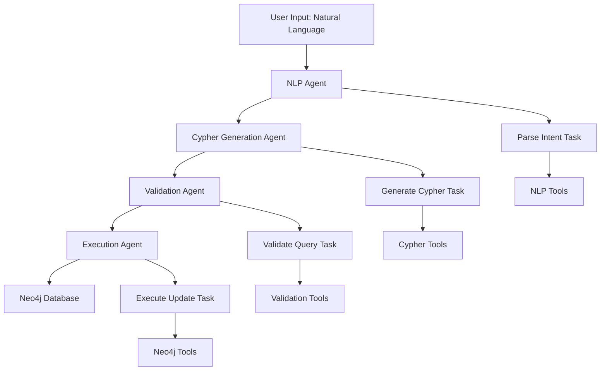
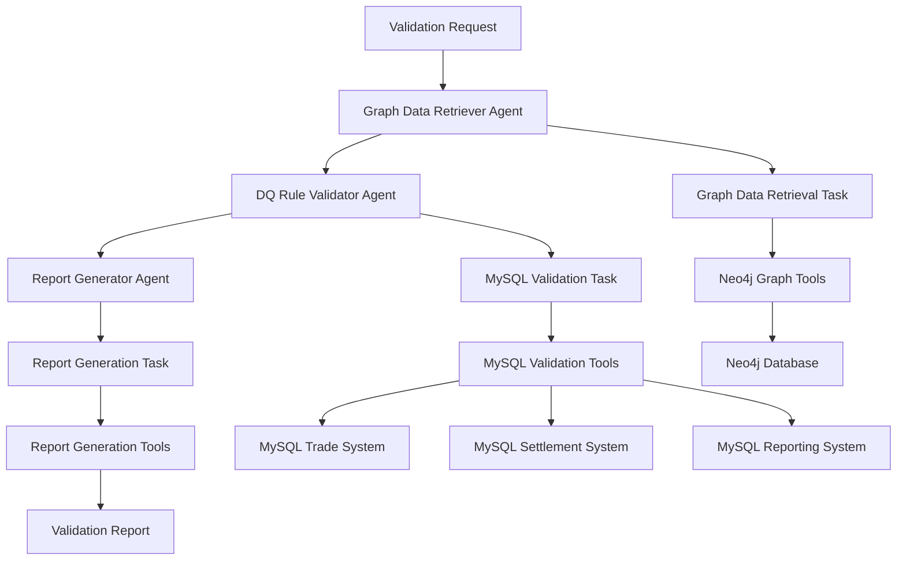
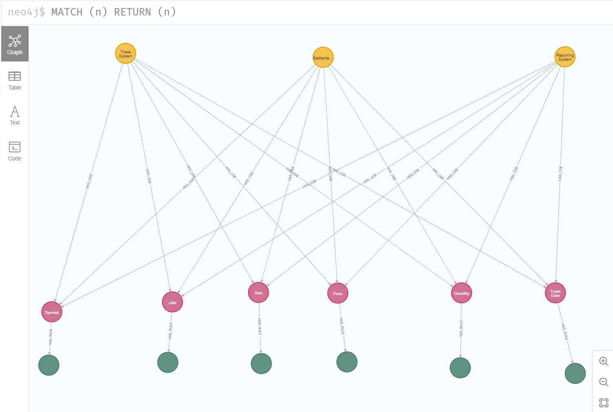

# Data Quality Rule Validation System for Investment Banking

## Project Description

### Business Problem

In modern investment banking operations, data flows through multiple systems from front-office trading platforms to back-office settlement systems and regulatory reporting systems. Ensuring data quality and consistency across this complex ecosystem is critical for:

- **Regulatory Compliance**: Meeting stringent financial regulations and reporting requirements
- **Risk Management**: Identifying and mitigating data-related operational risks
- **Operational Efficiency**: Reducing manual data reconciliation and error correction
- **Data Integrity**: Maintaining accurate and consistent data across all systems

Traditional data quality approaches often rely on siloed validation rules that don't consider the complete data lineage. This project addresses this challenge by implementing a **graph database-driven approach** that defines Critical Data Elements (CDEs) and Data Quality (DQ) Rules from a comprehensive data lineage perspective.

### Solution Overview

This system uses **Neo4j graph database** to model the relationships between:
- **Critical Data Elements (CDEs)**: Key data fields that flow through trading systems
- **Data Quality Rules**: Validation logic applied to ensure data integrity
- **System Dependencies**: How data flows from Front Office → Settlement → Reporting systems

The solution validates DQ rules across three core systems:
1. **Front Office Trading System** (MySQL)
2. **Back Office Settlement System** (MySQL)  
3. **Regulatory Reporting System** (MySQL)

By taking a **data lineage perspective**, the system can identify violations that might be missed by traditional point-in-time validation approaches.

## Applications

This project consists of **three complementary applications** built using **CrewAI** as the agentic framework:

### Application 1: Graph Database Management Tool
**Purpose**: Modify Neo4j graph database CDEs and DQ Rules using natural language

**Key Features**:
- Natural language processing to understand CDE and DQ Rule modifications
- Automatic conversion of plain English instructions to Cypher queries
- Safe execution of graph database updates
- Validation of changes before applying to production graph

**Use Case**: "Add a new DQ rule that ensures all trade amounts are positive and greater than $1000"

### Application 2: Data Quality Validation Engine  
**Purpose**: Apply DQ Rules from the graph database across all three relational database systems

**Key Features**:
- Retrieves CDEs and DQ Rules from Neo4j graph database
- Validates rules across Trade, Settlement, and Reporting systems
- Generates comprehensive violation reports
- Provides system-by-system analysis and recommendations

**Use Case**: Nightly validation runs to identify data quality violations across the trading pipeline

### Application 3: GraphDB Query UI
**Purpose**: Interactive web interface for querying the Neo4j graph database with natural language

**Key Features**:
- 🤖 **Natural Language Queries**: Ask questions in plain English
- ⚡ **Direct Cypher Execution**: Write and execute Cypher queries directly
- 📊 **Schema Visualization**: View database structure and sample data
- 🔍 **Real-time Results**: See query results in formatted tables
- 💡 **Example Queries**: Pre-built examples to get you started
- 🎨 **Modern UI**: Clean, responsive design that works on all devices

**Use Cases**:
- "Show me all CDEs with their associated rules"
- "What rules are associated with Trade Date?"
- "Find CDEs that have NOT_NULL rules"
- "Show me all systems and their CDEs"

#### Quick Start for GraphDB Query UI

**Prerequisites**:
1. **Python 3.7+** installed
2. **Neo4j Database** running with your graph data
3. **OpenAI API Key** for natural language processing
4. **Required Python packages** (see installation below)

**Installation**:
```bash
# Install dependencies (if not already done)
pip install -r requirements.txt

# Set OpenAI API key
export OPENAI_API_KEY="your-api-key-here"  # Linux/Mac
set OPENAI_API_KEY=your-api-key-here       # Windows

# Start the UI
python graphdb_ui.py

# Or use the startup scripts
./run_graphdb_ui.sh          # Linux/Mac
```

**Access**: Open your browser to `http://localhost:5050`

#### Usage

**Natural Language Queries**:
The UI can understand questions like:
- "Show me all CDEs"
- "Find all data quality rules"
- "What rules are associated with Trade Date?"
- "Show me all systems and their CDEs"
- "Find CDEs that have NOT_NULL rules"

**Direct Cypher Queries**:
For advanced users, you can write Cypher queries directly:
```cypher
MATCH (cde:CDE)-[:HAS_RULE]->(rule:DQRule)
RETURN cde.name, rule.description
```

**Example Queries**:
The UI includes several example queries you can click to try:
1. **Show me all CDEs** - Lists all Critical Data Elements
2. **Find all data quality rules** - Shows all DQ rules in the database
3. **What rules are associated with Trade Date?** - Shows rules for a specific CDE
4. **Show me all systems and their CDEs** - Displays system-CDE relationships
5. **Find CDEs that have NOT_NULL rules** - Filters CDEs by rule type

#### Database Schema

The UI is designed to work with a Neo4j database containing:

**Node Types**:
- **CDE** (Critical Data Element): `name`, `description`, `dataType`
- **DQRule** (Data Quality Rule): `id`, `description`, `ruleType`
- **System**: `name`, `dbType`, `dbTable`, `description`

**Relationships**:
- `(CDE)-[:HAS_RULE]->(DQRule)` - Links CDEs to their quality rules
- `(System)-[:HAS_CDE]->(CDE)` - Links systems to their CDEs

#### API Endpoints

The UI provides several REST API endpoints:

**`GET /api/schema`**:
Returns database schema information including node counts, relationship counts, and sample data.

**`POST /api/query`**:
Processes natural language queries:
```json
{
  "query": "Show me all CDEs"
}
```

**`POST /api/cypher`**:
Executes direct Cypher queries:
```json
{
  "query": "MATCH (cde:CDE) RETURN cde"
}
```

#### Configuration

**Neo4j Connection**:
The UI uses the existing `Neo4jConnection` class from `neo4j_tools.py`. Make sure your Neo4j connection settings are correct:

```python
# Default settings in neo4j_tools.py
uri = "bolt://localhost:7687"
user = "neo4j"
password = "testtest"
database = "neo4j"
```

**OpenAI Configuration**:
The natural language processing uses OpenAI's GPT-3.5-turbo model. You can modify the model in `graphdb_ui.py`:

```python
llm = ChatOpenAI(
    model="gpt-3.5-turbo",  # Change to gpt-4 for better results
    temperature=0.1,
    api_key=os.getenv("OPENAI_API_KEY")
)
```

#### Troubleshooting

**Common Issues**:

1. **"Neo4j connection failed"**
   - Ensure Neo4j database is running
   - Check connection settings in `neo4j_tools.py`
   - Verify database contains the expected schema

2. **"Required packages not installed"**
   - Run `pip install -r requirements.txt`
   - Ensure you're using Python 3.7+

3. **"OpenAI API key not set"**
   - Set the `OPENAI_API_KEY` environment variable
   - Natural language queries won't work without this

4. **"Query contains potentially dangerous operations"**
   - The UI blocks DELETE, DROP, and REMOVE operations for safety
   - Use direct Cypher execution for administrative operations

**Debug Mode**:
```bash
python graphdb_ui.py --debug
```

**Logs**: Check the console output for detailed error messages and query execution logs.

#### Security Considerations

- The UI blocks potentially dangerous Cypher operations (DELETE, DROP, REMOVE)
- All queries are logged for audit purposes
- Consider running behind a reverse proxy for production use
- Ensure proper authentication for production deployments

#### Development

**Project Structure**:
```
├── graphdb_ui.py          # Main Flask application
├── templates/
│   └── index.html         # UI template
├── run_graphdb_ui.sh      # Linux/Mac startup script
├── run_graphdb_ui.bat     # Windows startup script
└── GRAPHDB_UI_README.md   # Detailed documentation
```

## How to Run the Applications

### Prerequisites
- Python 3.10+ with Anaconda environment
- Neo4j Database (v5.x) running locally or remotely
- MySQL databases for the three trading systems
- OpenAI API key for LLM functionality

### Setup
1. **Clone the repository**
   ```bash
   git clone <repository-url>
   cd graph-db-agent-rule-quality
   ```

2. **Install dependencies**
   ```bash
   pip install -r requirements.txt
   ```

3. **Configure databases**
   - Update `mysql_config.py` with your MySQL connection details
   - Ensure Neo4j is running and accessible

4. **Set environment variables**
   ```bash
   export OPENAI_API_KEY='your-openai-api-key'
   ```

### Running Application 1: Graph Database Management
```bash
# Interactive mode for graph database modifications
python main.py
```

### Running Application 2: Data Quality Validation

#### Quick Start
```bash
# Full validation workflow
./run_dq_validation.sh

# Or use the interactive menu
python dq_main.py

# Test specific UITIDs
python dq_main.py --uitids="UIT-0001-ABC,UIT-0002-XYZ,UIT-0003-DEF"
```

#### Interactive Menu Options

The system provides four main options:

**1. Full DQ Validation Workflow**
- Retrieves all CDEs and DQ rules from Neo4j
- Tests MySQL connections to all three systems
- Validates DQ rules across specified UITIDs
- Generates comprehensive reports

**Parameters:**
- **UITIDs**: Specify comma-separated UITIDs or use random sample
- **Limit**: Maximum number of UITIDs to check (default: 10)
- **Report Format**: Choose from 'table', 'summary', or 'csv'

**2. MySQL Connection Test Only**
- Tests connectivity to all three MySQL systems
- Useful for troubleshooting database connection issues

**3. Neo4j Graph Data Retrieval Only**
- Retrieves and displays CDE and DQ rule data from Neo4j
- Useful for verifying graph database content

**4. Exit**
- Safely exit the application

### Running Application 3: GraphDB Query UI
```bash
# Start the web interface
python graphdb_ui.py

# Or use startup scripts
./run_graphdb_ui.sh          # Linux/Mac
run_graphdb_ui.bat           # Windows
```

**Access**: Open your browser to `http://localhost:5000`

### Configuration

#### MySQL Database Configuration
Edit `mysql_config.py` to match your database settings:

```python
MYSQL_CONFIGS = {
    'Trade System': {
        'host': 'your-trade-db-host',
        'port': 3306,
        'database': 'trade_system_db',
        'user': 'your_username',
        'password': 'your_password'
    },
    # ... similar for Settlement System and Reporting System
}
```

#### CDE Column Mappings
The system has built-in column mappings for common CDEs:

```python
# Built-in mappings in dq_validation_tools.py:
Price -> 'price'
Quantity -> 'quantity'
Side -> 'side'
Symbol -> {'Trade System': 'symbol', 'Settlement System': 'symbol', 'Reporting System': 'instrument_symbol'}
Trade Date -> 'trade_date'
uitid -> 'uitid'
```

### Testing and Debugging

#### Manual Testing Scripts

**Debug MySQL Data**
```bash
python test/debug_mysql_data.py
```
Shows actual data in all three MySQL systems for specific UITIDs.

**Test Validation Logic Directly**
```bash
python test/test_validation_direct.py
```
Tests the underlying validation logic without CrewAI to verify it correctly detects violations.

**Test Neo4j Graph Data**
```bash
python test/test_graph_data.py
```
Verifies that all expected CDEs and DQ rules are properly configured in Neo4j.

**Test Database Connections**
```bash
python test/test_connection.py
```

**Validation Workflow Testing**
For testing specific UITIDs:
```bash
python dq_main.py --uitids="UIT-0001-ABC,UIT-0002-XYZ,UIT-0003-DEF"
```

## Expected Output Format

### Successful Validation Example
When validating UITIDs: UIT-0001-ABC, UIT-0002-XYZ, UIT-0003-DEF, the system should produce:

```
================================================================================
WORKFLOW COMPLETED SUCCESSFULLY
================================================================================
## EXECUTIVE SUMMARY
- Total CDEs validated: 6
- Total violations found: 3
- Overall violation rate: 16.7% (3 violations out of 18 total validations)

## DETAILED VALIDATION RESULTS

| CDE        | DQ Rule Description                      | uitid          | Trade System | Settlement System | Reporting System |
|------------|------------------------------------------|----------------|--------------|-------------------|------------------|
| uitid      | uitid cannot be null                     | UIT-0001-ABC  | OK           | OK                | OK               |
| uitid      | uitid cannot be null                     | UIT-0002-XYZ  | OK           | OK                | OK               |
| uitid      | uitid cannot be null                     | UIT-0003-DEF  | OK           | OK                | OK               |
| Price      | Price must be positive                   | UIT-0001-ABC  | OK           | OK                | OK               |
| Price      | Price must be positive                   | UIT-0002-XYZ  | OK           | OK                | OK               |
| Price      | Price must be positive                   | UIT-0003-DEF  | OK           | OK                | OK               |
| Quantity   | Quantity must be positive                | UIT-0001-ABC  | OK           | OK                | OK               |
| Quantity   | Quantity must be positive                | UIT-0002-XYZ  | VIOLATION    | OK                | OK               |
| Quantity   | Quantity must be positive                | UIT-0003-DEF  | OK           | OK                | OK               |
| Side       | Side must be either BUY or SELL         | UIT-0001-ABC  | OK           | OK                | OK               |
| Side       | Side must be either BUY or SELL         | UIT-0002-XYZ  | OK           | OK                | OK               |
| Side       | Side must be either BUY or SELL         | UIT-0003-DEF  | OK           | OK                | OK               |
| Symbol     | Symbol must not be null                  | UIT-0001-ABC  | OK           | OK                | OK               |
| Symbol     | Symbol must not be null                  | UIT-0002-XYZ  | OK           | OK                | OK               |
| Symbol     | Symbol must not be null                  | UIT-0003-DEF  | OK           | VIOLATION         | OK               |
| Trade Date | Trade Date cannot be null                | UIT-0001-ABC  | OK           | OK                | VIOLATION        |
| Trade Date | Trade Date cannot be null                | UIT-0002-XYZ  | OK           | OK                | OK               |
| Trade Date | Trade Date cannot be null                | UIT-0003-DEF  | OK           | OK                | OK               |

## VIOLATIONS SUMMARY
Exactly 3 violations:
- Quantity: UIT-0002-XYZ - Trade System - negative value (-15)
- Symbol: UIT-0003-DEF - Settlement System - null value
- Trade Date: UIT-0001-ABC - Reporting System - null value

## SYSTEM ANALYSIS
- Trade System: 1/3 (33%) - UIT-0002-XYZ Quantity violation
- Settlement System: 1/3 (33%) - UIT-0003-DEF Symbol violation
- Reporting System: 1/3 (33%) - UIT-0001-ABC Trade Date violation
```

### Key Output Features
- **No N/A values**: All CDEs should show OK or VIOLATION status
- **Exact violation count**: Should detect exactly 3 violations for test data
- **Correct system mapping**: Each violation appears in exactly one system
- **Complete CDE coverage**: All 6 CDEs (uitid, Price, Quantity, Side, Symbol, Trade Date) validated

## Supported DQ Rule Types

- **NOT_NULL**: Validates that values are not null or empty
- **POSITIVE_VALUE**: Ensures numeric values are greater than zero
- **ENUM_VALUE**: Validates values against predefined sets (e.g., BUY/SELL)

## Application Architecture Diagrams

### Application 1: Graph Database Management Workflow



**Agents**:
- **NLP Agent**: Interprets natural language instructions
- **Cypher Generation Agent**: Converts intent to Cypher queries
- **Validation Agent**: Ensures query safety and correctness
- **Execution Agent**: Applies changes to Neo4j database

**Tasks**:
- **Parse Intent Task**: Extract user requirements from natural language
- **Generate Cypher Task**: Create appropriate Cypher statements
- **Validate Query Task**: Check query syntax and safety
- **Execute Update Task**: Apply changes to graph database

**Tools**:
- **NLP Tools**: Language processing and intent recognition
- **Cypher Tools**: Query generation and optimization
- **Validation Tools**: Syntax checking and safety validation
- **Neo4j Tools**: Database connection and execution

### Application 2: Data Quality Validation Workflow



**Agents**:
- **Graph Data Retriever Agent**: Fetches CDEs and DQ Rules from Neo4j
- **DQ Rule Validator Agent**: Validates rules across all MySQL systems
- **Report Generator Agent**: Creates comprehensive violation reports

**Tasks**:
- **Graph Data Retrieval Task**: Extract current CDEs and rules from graph
- **MySQL Validation Task**: Apply rules to all three database systems
- **Report Generation Task**: Compile results into actionable reports

**Tools**:
- **Neo4j Graph Tools**: Graph database query and retrieval
- **MySQL Validation Tools**: Database connection and rule validation
- **Report Generation Tools**: Report formatting and analysis

## Graph Database Structure



### Node Types

**CDE (Critical Data Element)**
- Represents key data fields that flow through the trading pipeline
- Properties: `name`, `dataType`, `columnName`, `description`
- Examples: Price, Quantity, Trade Date, Settlement Date, Symbol

**DQRule (Data Quality Rule)**  
- Defines validation logic for data quality checks
- Properties: `id`, `description`, `ruleType`, `parameters`
- Rule Types: `NOT_NULL`, `POSITIVE_VALUE`, `ENUM_VALUE`, `DATE_RANGE`

**System**
- Represents the three database systems in the trading pipeline
- Properties: `name`, `type`, `description`
- Systems: Trade System, Settlement System, Reporting System

### Relationship Types

**HAS_RULE**: `(CDE)-[:HAS_RULE]->(DQRule)`
- Links CDEs to their applicable data quality rules
- Allows multiple rules per CDE for comprehensive validation

**HAS_CDE**: `(System)-[:HAS_CDE]->(CDE)`  
- Defines which CDEs are present in each system
- Enables system-specific validation logic

**FLOWS_TO**: `(System)-[:FLOWS_TO]->(System)`
- Models data flow between systems
- Supports data lineage analysis and impact assessment

### Graph Database Benefits

- **Relationship Modeling**: Captures complex dependencies between data elements
- **Flexible Schema**: Easy to add new CDEs, rules, or systems
- **Query Power**: Cypher queries enable sophisticated data lineage analysis
- **Visual Representation**: Graph structure provides intuitive understanding of data flow

## Database Diagrams

### Front Office Trading System (MySQL)

**Table: trades**
```sql
- trade_id (PRIMARY KEY, INT, NOT NULL)
- trader_id (VARCHAR(32), NOT NULL)
- symbol (VARCHAR(20), NOT NULL)
- cusip (VARCHAR(15), NOT NULL)  
- side (ENUM('BUY','SELL'), NOT NULL)
- trade_date (DATE, NULL)
- settle_date (DATE, NULL)
- quantity (INT, NOT NULL)
- price (DECIMAL(15,4), NOT NULL)
- net_amount (DECIMAL(18,2), NULL)
- trade_currency (CHAR(3), DEFAULT 'USD')
- settlement_currency (CHAR(3), DEFAULT 'USD')
- book_name (VARCHAR(10), NOT NULL)
- uitid (VARCHAR(64), NULL) -- Unique Identifier
- created_at (TIMESTAMP, DEFAULT CURRENT_TIMESTAMP)
```

### Back Office Settlement System (MySQL)

**Table: settlements**
```sql
- trade_id (PRIMARY KEY, BIGINT, NOT NULL)
- counterparty_name (VARCHAR(100), NOT NULL)
- symbol (VARCHAR(10), NULL)
- cusip (VARCHAR(15), NOT NULL)
- trade_date (DATE, NULL)
- settlement_date (DATE, NOT NULL)
- side (ENUM('BUY','SELL'), NOT NULL)
- quantity (INT, NOT NULL)
- price (DECIMAL(18,6), NOT NULL)
- net_amount (DECIMAL(18,2), NULL)
- trade_currency (CHAR(3), DEFAULT 'USD')
- settlement_currency (CHAR(3), DEFAULT 'USD')
- book_name (VARCHAR(10), NOT NULL)
- settlement_status (ENUM('NOT_STARTED','IN_PROCESS','SETTLED','FAILED'))
- source_system (VARCHAR(64), NULL)
- uitid (VARCHAR(64), NULL) -- Links to Trading System
- settlement_location (VARCHAR(64), NULL)
- created_at (TIMESTAMP, DEFAULT CURRENT_TIMESTAMP)
- updated_at (TIMESTAMP, DEFAULT CURRENT_TIMESTAMP)
```

### Regulatory Reporting System (MySQL)

**Table: regulatory_reports**
```sql
- trade_id (PRIMARY KEY, BIGINT, NOT NULL)
- uitid (VARCHAR(64), NULL) -- Links to upstream systems
- counterparty_name (VARCHAR(100), NULL)
- book_name (VARCHAR(10), NULL)
- trader_id (VARCHAR(32), NULL)
- instrument_symbol (VARCHAR(20), NULL) -- Different column name
- instrument_name (VARCHAR(100), NULL)
- asset_class (ENUM('EQUITY','BOND','FX','DERIVATIVE','COMMODITY'))
- side (ENUM('BUY','SELL'), NULL)
- trade_date (DATE, NULL)
- settlement_date (DATE, NULL)
- quantity (INT, NULL)
- price (DECIMAL(18,6), NULL)
- notional_value (DECIMAL(20,2), NULL)
- trade_currency (CHAR(3), DEFAULT 'USD')
- settlement_currency (CHAR(3), DEFAULT 'USD')
- trade_status (ENUM('CONFIRMED','CANCELLED','SETTLED','AMENDED'))
- source_system (VARCHAR(64), NULL)
- reporting_timestamp (TIMESTAMP, DEFAULT CURRENT_TIMESTAMP)
- mifid_flag (TINYINT(1), DEFAULT 0)
- lei_code (VARCHAR(20), NULL)
- trade_venue (VARCHAR(50), NULL)
```

## Known Issues

### Hard-Coded CDEs and DQ Rules
**Issue**: Some Critical Data Elements and Data Quality Rules have been hard-coded during development with **Cursor AI code generation**. This creates maintenance challenges and reduces system flexibility.

**Impact**:
- Adding new CDEs requires code modifications
- DQ Rule changes may not be automatically detected
- System is not fully generic for all trading scenarios

**Investigation Needed**: 
- Analyze Cursor's code generation patterns and limitations
- Evaluate other AI code generation tools (GitHub Copilot, Tabnine, Windsurf)
- Develop best practices for maintaining generic, data-driven code

### Non-Deterministic Agentic Behavior
**Issue**: Due to the **agentic AI approach** using CrewAI and LLMs, output results are not always deterministic.

**Symptoms**:
- Occasional variations in validation reports
- Different agent responses to identical inputs
- Inconsistent handling of edge cases

**Mitigation Strategies**:
- Enhanced prompt engineering for more consistent outputs
- Validation checks and retries for critical operations
- Comprehensive testing with known expected results

### System Integration Complexity
**Issue**: Integration between Neo4j graph database and multiple MySQL systems creates complexity in data synchronization and consistency.

**Challenges**:
- Schema evolution across different database types
- Performance optimization for large-scale validation
- Error handling across distributed systems

## Troubleshooting

### Resolved Issues (Historical Reference)

#### No Violations Detected (Previously Fixed)
**Symptoms**: System reports 0 violations when violations should exist
**Root Cause**: DQ Validator agent wasn't calling mysql_validation for all CDEs
**Solution**: Enhanced validation task with explicit instructions and tool calls for each CDE

#### N/A Values in Results (Previously Fixed)
**Symptoms**: Detailed results show "N/A" instead of "OK" or "VIOLATION"
**Root Cause**: Report Generator treating available columns as unavailable
**Solution**: Enhanced report generation task with specific validation checks

#### Incorrect System Analysis (Previously Fixed)
**Symptoms**: System analysis shows wrong percentages
**Root Cause**: Improper calculation of violations per system
**Solution**: Explicit instructions for 1 violation per system calculation

### Current Issue Troubleshooting

#### MySQL Connection Failures
- Verify database configurations in `mysql_config.py`
- Check database server availability
- Confirm user credentials and permissions
- Use option 2 (Connection Test) to diagnose issues

#### Neo4j Connection Issues
- Ensure Neo4j database is running
- Verify connection settings in `neo4j_tools.py`
- Check that CDEs and DQ rules exist in the graph
- Use `python test/test_graph_data.py` to verify graph structure

#### OpenAI API Issues
- Verify API key is set correctly
- Check API key permissions and usage limits

### Validation Checks
The system now includes comprehensive validation checks:
- ✅ All 6 CDEs must be validated
- ✅ Exactly 3 violations must be found for test data
- ✅ Each violation must appear in exactly one system
- ✅ No N/A values should appear in results
- ✅ System analysis must show correct percentages

### Performance Considerations

- **UITID Limiting**: Use the limit parameter to control validation scope
- **Batch Processing**: The system processes UITIDs in batches for efficiency
- **Connection Pooling**: Database connections are reused across validations
- **Explicit Validation**: Enhanced task instructions ensure all CDEs are validated

### Security Notes

- Database credentials are stored in plain text in `mysql_config.py`
- Consider using environment variables or encrypted storage for production
- Ensure proper database user permissions (read-only recommended)
- Protect OpenAI API key from unauthorized access

## Future Development

### 1. Fully Generic CDE and Rule Management
**Goal**: Eliminate hard-coded elements to create a completely data-driven system

**Implementation**:
- Dynamic CDE discovery from graph database
- Runtime rule compilation and validation
- Generic column mapping based on graph relationships
- Automated code generation for new validation scenarios

**Benefits**:
- Zero-code changes for new CDEs or rules
- Faster deployment of data quality updates
- Improved maintainability and scalability

### 2. User Interface Development
**Goal**: Create an intuitive web-based interface for system management

**Features**:
- Graph database visualization and editing
- Real-time validation dashboard
- Historical violation trend analysis
- Drag-and-drop rule configuration
- System health monitoring

**Technology Stack**: React/Vue.js frontend with FastAPI backend

### 3. Advanced Code Generation Tool Evaluation
**Goal**: Experiment with alternative AI code generation tools

**Tools to Evaluate**:
- **Windsurf**: Next-generation AI coding assistant
- **GitHub Copilot**: Microsoft's AI pair programmer  
- **Tabnine**: AI-powered code completion
- **Amazon CodeWhisperer**: AWS code generation service

**Evaluation Criteria**:
- Code quality and maintainability
- Understanding of complex business logic
- Integration with existing frameworks
- Performance and reliability

### 4. Enhanced Data Lineage Capabilities
**Goal**: Expand data lineage tracking and impact analysis

**Features**:
- End-to-end data flow visualization
- Change impact assessment
- Data quality score trending
- Automated data catalog generation
- Cross-system dependency mapping

## System Extension and Maintenance

### Extending the System

#### Adding New DQ Rule Types
1. Extend the validation logic in `MySQLConnectionManager.validate_dq_rule()`
2. Add appropriate conditions for the new rule type

#### Adding New Systems
1. Update `MYSQL_CONFIGS` in `mysql_config.py`
2. Modify system lists in validation tools and agents

#### Custom Report Formats
1. Add new format methods to `DQReportGeneratorTool`
2. Update the format selection logic

### Support and Maintenance

#### Regular Maintenance
- Monitor database connections and performance
- Update CDE column mappings as schema changes
- Review and extend DQ rule types as business needs evolve
- Run test scripts periodically to verify system health

#### Quality Assurance
Use the provided testing scripts to verify system functionality:
1. `python test/test_graph_data.py` - Verify Neo4j data structure
2. `python test/debug_mysql_data.py` - Check MySQL data content
3. `python test/test_validation_direct.py` - Test validation logic
4. Full workflow test with known UITIDs

### Version History

- **v1.0**: Initial implementation with 3-agent CrewAI architecture
- **v1.1**: Added comprehensive testing and debugging tools
- **v1.2**: Fixed validation workflow issues:
  - Resolved 0 violations detection issue
  - Eliminated N/A values in results
  - Corrected system analysis calculations
  - Enhanced task instructions for reliable validation
- **v1.3**: Added explicit validation checks and error prevention
  - Support for NOT_NULL, POSITIVE_VALUE, and ENUM_VALUE rule types
  - Interactive menu system with multiple report formats
  - Configurable database connections and parameters

## Technology Stack

### Agentic AI Framework
- **CrewAI**: Multi-agent orchestration and task management
- **OpenAI GPT Models**: Large language model for natural language processing
- **LangChain**: LLM application development framework

### Databases
- **Neo4j**: Graph database for CDEs, rules, and relationships
- **MySQL**: Relational databases for trading systems
- **Connection Pooling**: Efficient database connection management

### Development Tools
- **Cursor**: AI-powered code generation and development
- **Python 3.10+**: Core development language
- **Anaconda**: Environment and dependency management

### Testing and Quality Assurance
- **pytest**: Unit and integration testing
- **Custom Testing Scripts**: Database validation and system verification
- **Automated Test Suites**: Continuous quality assurance

## Introduction to Agentic AI

**Agentic AI** represents a paradigm shift from traditional AI applications to **autonomous, goal-oriented systems** that can reason, plan, and execute complex tasks with minimal human intervention.

### Key Characteristics

**Autonomy**: AI agents can make decisions and take actions independently based on their understanding of goals and constraints.

**Goal-Oriented**: Agents work towards specific objectives, adapting their approach based on feedback and changing conditions.

**Multi-Step Reasoning**: Ability to break down complex problems into manageable subtasks and execute them sequentially or in parallel.

**Environmental Interaction**: Agents can perceive their environment (databases, APIs, files) and modify it through actions.

### Benefits for Enterprise Applications

- **Reduced Manual Intervention**: Automate complex workflows that previously required human oversight
- **Adaptive Problem Solving**: Handle edge cases and unexpected scenarios through reasoning
- **Scalable Operations**: Deploy agents to handle increasing workloads without proportional human resource growth
- **24/7 Operations**: Continuous monitoring and response capabilities

### Applications in Data Quality

In this project, agentic AI enables:
- **Intelligent Rule Application**: Agents understand context and apply rules appropriately
- **Dynamic Problem Resolution**: Automatic handling of data quality exceptions
- **Natural Language Interface**: Users can describe data quality requirements in plain English
- **Adaptive Reporting**: Reports that adjust based on findings and stakeholder needs

## Introduction to CrewAI

**CrewAI** is a cutting-edge framework for building **multi-agent AI systems** that can collaborate to solve complex problems through coordinated teamwork.

### Core Concepts

**Agents**: Specialized AI entities with specific roles, goals, and capabilities
- Each agent has a defined backstory and expertise area
- Agents can use tools and make decisions within their domain
- Communication and collaboration between agents

**Tasks**: Specific objectives that agents work to complete
- Well-defined inputs, outputs, and success criteria
- Can be dependent on other tasks for sequential workflows
- Support for parallel execution when appropriate

**Crews**: Collections of agents organized to work together
- Defined processes (sequential, hierarchical, consensus)
- Shared context and memory between agents
- Coordinated execution and result compilation

**Tools**: External capabilities that agents can leverage
- Database connections, API calls, file operations
- Custom business logic and validation functions
- Integration with external systems and services

### CrewAI in This Project

**Application 1 Crew**: Graph Database Management
- **NLP Agent**: Understands natural language requirements
- **Cypher Agent**: Generates database queries
- **Validation Agent**: Ensures query safety and correctness
- **Execution Agent**: Applies changes to the graph database

**Application 2 Crew**: Data Quality Validation
- **Graph Retriever Agent**: Fetches CDEs and rules from Neo4j
- **Validator Agent**: Applies rules across MySQL systems
- **Report Generator Agent**: Creates comprehensive violation reports

### Advantages of CrewAI

- **Specialized Expertise**: Each agent focuses on specific domain knowledge
- **Scalability**: Add new agents for additional capabilities
- **Maintainability**: Clear separation of concerns and responsibilities
- **Flexibility**: Modify individual agents without affecting the entire system

## Introduction to Graph Databases

**Graph databases** store data as **nodes (entities)** and **relationships (connections)**, making them ideal for modeling complex, interconnected data structures that are common in enterprise systems.

### Why Graph Databases for Data Quality?

**Relationship-Centric Modeling**: Traditional relational databases struggle to represent the complex relationships between data elements, systems, and rules. Graph databases excel at this.

**Intuitive Data Representation**: The graph structure mirrors how business users think about data flow and dependencies.

**Flexible Schema**: Easy to add new types of nodes and relationships without major schema changes.

**Powerful Query Language**: Cypher queries can traverse relationships efficiently to answer complex questions about data lineage.

### Graph vs. Relational Databases

| Aspect | Graph Database | Relational Database |
|--------|----------------|-------------------|
| **Data Model** | Nodes and relationships | Tables and foreign keys |
| **Schema** | Flexible, evolving | Fixed, structured |
| **Relationships** | First-class citizens | Through joins |
| **Queries** | Traversal-based | Join-heavy |
| **Use Cases** | Connected data, recommendations | Transactions, reporting |

### Neo4j Advantages

- **ACID Compliance**: Ensures data consistency and reliability
- **Cypher Query Language**: Expressive, SQL-like syntax for graph operations
- **Visualization Tools**: Built-in graph visualization and exploration
- **Performance**: Optimized for relationship traversals
- **Ecosystem**: Rich set of tools, libraries, and integrations

### Graph Database Benefits in Trading Systems

**Data Lineage Tracking**: Understand how data flows from trading through settlement to reporting.

**Impact Analysis**: Quickly identify which systems and processes are affected by data quality issues.

**Rule Dependency Management**: Model complex relationships between different validation rules.

**System Integration Mapping**: Visualize and manage connections between disparate trading systems.

## Framework and Technology Stack

### Core Frameworks

**CrewAI** - Multi-agent AI orchestration
- Version: Latest stable release
- Purpose: Agent coordination and task management
- Integration: OpenAI API for LLM capabilities

**LangChain** - LLM Application Development
- Version: Compatible with CrewAI requirements  
- Purpose: LLM integration and prompt management
- Features: Memory, chains, and agent tools

**FastAPI** (Future) - Web API Framework
- Purpose: RESTful API for future UI development
- Features: Automatic API documentation, async support

### Database Technologies

**Neo4j** - Graph Database
- Version: 5.x Community/Enterprise
- Purpose: CDE and rule relationship modeling
- Driver: Official Python driver (neo4j)

**MySQL** - Relational Database Systems
- Version: 8.0+
- Purpose: Trading, settlement, and reporting data
- Driver: mysql-connector-python

### Development and AI Tools

**Python** - Core Development Language
- Version: 3.10+
- Environment: Anaconda for dependency management
- Key Libraries: pandas, numpy, pydantic

**OpenAI API** - Large Language Models
- Models: GPT-4, GPT-3.5-turbo
- Purpose: Natural language processing and reasoning
- Integration: Official OpenAI Python client

### Testing and Quality Assurance

**pytest** - Testing Framework
- Unit tests for individual components
- Integration tests for database operations
- Custom fixtures for test data management

**Custom Testing Suite**
- Database validation scripts
- System connectivity verification
- End-to-end workflow testing

## Introduction to Vibe Coding

**Vibe Coding** represents a new paradigm in software development that emphasizes **intuitive, flow-state programming** enhanced by AI assistance. It's about maintaining development momentum and creative problem-solving through seamless human-AI collaboration.

### Core Principles

**Flow State Maintenance**: Minimize context switching and interruptions that break developer focus.

**Intuitive Problem Solving**: Rely on developer intuition and experience, augmented by AI suggestions.

**Rapid Iteration**: Quick cycles of idea → implementation → testing → refinement.

**Natural Language Integration**: Describe intent in plain English, let AI handle implementation details.

### Vibe Coding in Practice

**This Project's Development**:
- Described business requirements in natural language
- Used AI to generate initial code structure and boilerplate
- Iteratively refined through human insight and AI assistance
- Maintained focus on business logic rather than syntax

**Benefits Observed**:
- Faster time-to-prototype for complex multi-agent systems
- More time spent on architecture and business logic
- Reduced debugging time through AI-assisted error detection
- Natural evolution of code structure through conversation

### Vibe Coding vs Traditional Development

| Aspect | Vibe Coding | Traditional Coding |
|--------|-------------|-------------------|
| **Planning** | Organic, conversational | Detailed upfront design |
| **Implementation** | AI-assisted, iterative | Manual, methodical |
| **Problem Solving** | Intuitive + AI suggestions | Research + documentation |
| **Debugging** | Collaborative with AI | Individual troubleshooting |
| **Documentation** | Generated from conversations | Written separately |

### Tools That Enable Vibe Coding

- **Cursor**: AI-first code editor with natural language interface
- **GitHub Copilot**: Intelligent code completion and suggestion
- **ChatGPT/Claude**: Conversational problem-solving partners
- **Windsurf**: Next-generation AI coding environment

## Introduction to Cursor

**Cursor** is an **AI-first code editor** built from the ground up to integrate artificial intelligence into every aspect of the development process. It represents a fundamental shift from traditional IDEs to AI-collaborative development environments.

### Key Features

**Natural Language Code Generation**
- Describe functionality in plain English
- Generate complete functions, classes, and modules
- Contextual awareness of existing codebase

**Intelligent Code Completion**
- Multi-line suggestions based on context
- Understands patterns and conventions in your codebase
- Reduces boilerplate and repetitive coding

**Conversational Programming**
- Chat interface for asking questions about code
- Get explanations for complex logic
- Iterate on solutions through conversation

**Codebase Understanding**
- AI analyzes entire project structure
- Provides suggestions that fit existing architecture
- Maintains consistency across large codebases

### Cursor in This Project

**Architecture Generation**: Cursor helped design the multi-agent system structure and CrewAI integration patterns.

**Database Integration**: Generated MySQL and Neo4j connection logic with proper error handling and connection pooling.

**Agent Development**: Created specialized agents with appropriate tools and task definitions.

**Testing Infrastructure**: Built comprehensive testing suite with database validation and system verification.

### Development Workflow with Cursor

1. **Describe Requirements**: Explain what you want to build in natural language
2. **Review Suggestions**: Cursor generates code based on context and requirements  
3. **Iterate and Refine**: Provide feedback and adjust implementation
4. **Integrate Seamlessly**: Code fits naturally into existing project structure

### Benefits Experienced

- **Faster Development**: Reduced time from concept to working code
- **Better Architecture**: AI suggestions often improve initial design ideas
- **Consistent Quality**: Maintains coding standards across entire project
- **Learning Acceleration**: Discover new patterns and best practices

## Cursor vs. Other AI Code Generation Tools

### Comparison Matrix

| Feature | Cursor | GitHub Copilot | Tabnine | Windsurf | Amazon CodeWhisperer |
|---------|--------|---------------|---------|----------|---------------------|
| **Editor Integration** | Native AI editor | VS Code extension | Multi-editor | Native environment | IDE plugins |
| **Natural Language** | Full conversational | Limited prompts | Code completion | Advanced dialogue | Comment-based |
| **Codebase Awareness** | Full project context | Limited context | Local patterns | Project understanding | Repository analysis |
| **Multi-file Edits** | Excellent | Limited | No | Advanced | Moderate |
| **Conversation Mode** | Built-in chat | Via extensions | No | Native chat | Limited |
| **Cost Model** | Subscription | GitHub integration | Tiered pricing | Early access | AWS integration |

### Cursor Advantages

**Holistic Development Environment**
- Not just a plugin but a complete development platform
- AI is integrated into every aspect of coding
- Seamless experience without context switching

**Superior Context Understanding**
- Analyzes entire codebase for relevant suggestions
- Understands project architecture and patterns
- Maintains consistency across large applications

**Natural Language Programming**
- Conversational interface for complex requirements
- Ability to describe high-level functionality
- Iterative refinement through dialogue

**Multi-file Coordination**
- Can edit multiple files simultaneously
- Understands dependencies between files
- Maintains consistency across changes

### When to Choose Cursor

**Best For**:
- Greenfield projects requiring rapid prototyping
- Complex architectures with multiple components
- Teams adopting AI-first development practices
- Projects requiring extensive refactoring

**Consider Alternatives When**:
- Working within established IDE workflows
- Simple code completion needs only
- Cost sensitivity for large teams
- Specific language or framework requirements

### Future of AI-Assisted Development

The evolution from traditional IDEs → AI-enhanced editors → AI-first environments like Cursor represents a fundamental shift in how we build software. As demonstrated in this project, the combination of:

- **Agentic AI frameworks** (CrewAI)
- **AI-first development tools** (Cursor)  
- **Natural language programming**
- **Iterative, conversational development**

Creates a powerful synergy that enables developers to build more sophisticated systems faster and with better architectural decisions than traditional approaches alone.

---

## Getting Started

Ready to explore the future of data quality management? Follow these steps:

### Quick Setup
1. **Environment Setup**: Install Python 3.10+ with Anaconda environment
2. **Database Configuration**: Update `mysql_config.py` with your database settings
3. **API Key**: Set your OpenAI API key: `export OPENAI_API_KEY='your-key'`
4. **Dependencies**: Run `pip install -r requirements.txt`

### Choose Your Application
- **Graph Database Management**: Run `python main.py` for natural language CDE/rule modifications
- **Data Quality Validation**: Run `python dq_main.py` for comprehensive validation workflows

### Validate Your Setup
Use our comprehensive test suite to verify everything works:
```bash
python test/test_graph_data.py        # Verify Neo4j structure
python test/debug_mysql_data.py       # Check MySQL data
python test/test_validation_direct.py # Test validation logic
```

**Questions?** Check out our [test suite](test/) for examples, explore the [database schemas](database/) to understand the data model, or review the troubleshooting section above.

*Built with ❤️ using Agentic AI, CrewAI, and Cursor*
